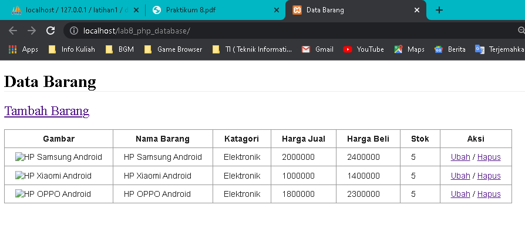
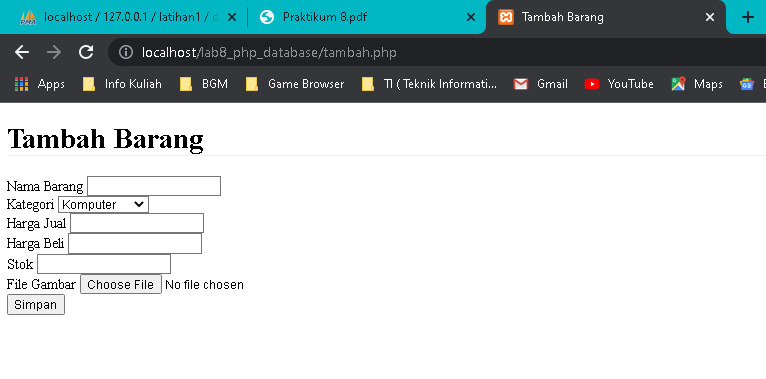

<p align="center">
	PEMROGRAMAN WEB
</p>
<p align="center">
	TUGAS PRATIKUM 8
</p>
<p align="center">
	Dosen Pengampu : Agung Nugroho, M.Kom
</p>
<p align="center"> 
	<b>Tugas untuk memenuhi syarat penilain pada Pert-10</b>
</p>

<p align="center">
	
</p>

<p align="center">
                 Nama  : Jose Fisto
</p>
<p align="center">
                 NIM   : 312010119
</p>
<p align="center">
                 Kelas : TI.20 A.1
</p>

<br/>
<br/>

<p align="center">
	<b>UNIVERSITAS PELITA BANGSA</b>
</p>
<p align="center">
	<b>FAKULTAS TEKNIK</b>
</p>
<p align="center">
	<b>TEKNIK INFORMATIKA</b>
</p>
<p align="center">
	<b>TA 2021 / 2022</b>
</p>

<br></br>

<hr>
</hr>

<br></br>

# Laporan Praktikum 8

Membuat CRUD Sederhana

Apa itu CRUD ?

CRUD adalah metode yang dapat dihubungkan dengan tampilan antarmuka (interface) sebagai fasilitator untuk melakukan perubahan data atau tampilan informasi berbentuk formulir, tabel atau laporan. Bentuk ini nantinya akan ditampilkan dalam browser atau aplikasi pada perangkat komputer pengguna.

Langkah langkah Membuat CRUD

1. Start modul xampp <br>
Langkah pertama ialah membuka xampp, dan selanjutnya start / hidupkan modul apache dan mysql

<p align="center">
	
</p>
<center>
    Gambar 1. Start Modul
</center>

Untuk pembuatan CRUD perlunya membuat database server menggunakan mysql, yang di jalankan langsung melalui xampp.

2. Mengakses MySQL client <br>
Perhatikan pada xampp untuk memastikan kedua modul sebelumnya telah berjalan dan kemudian buka halaman web service pada google chrome : http://localhost/phpmyadmin/ atau bisa mengklik `Admin` pada xampp di modul MySQL.

<p align="center">
	
</p>
<center>
    Gambar 2. Start Admin / Link phpmyadmin
</center>

<p align="center">
	
</p>
<center>
    Gambar 3. Tampilan phpmyadmin
</center>

3. Membuat Database : Studi Kasus Data Barang

Berikut studi kasus data barang

<p align="center">
	
</p>
<center>
    Gambar 4. Studi Data Barang
</center>

- nama field = merupakan field nama
- Tipe Data = tipe data karakter
- Ukuran = merupakan jumlah kata / batasan ketikan nama data
- Keterangan = merupakan opsi lanjutan mengisyaratkan bahwa pada salah satu field yang memiliki hak khusus 

4. Membuat Database <br>
Membuat database baru dengan menjalankan perintah koding pada tab `mysql`

koding :

```php
CREATE DATABASE latihan1;
USE latihan1
```

- Create database, membuat database baru
- USE, memilih data yang ingin di gunakan

<p align="center">
	
</p>
<center>
    Gambar 5. Tampilan Koding pada phpmyadmin
</center>

Sukses

<p align="center">
	
</p>
<center>
    Gambar 6. Sukses membuat Database
</center>

5. Membuat Tabel <br>
Selanjutnya membuat tabel dengan koding sebagai berikut

- Create Table, membuat tabel baru
- "(" dan ")", memuat perintah membuat isian tabel
- field_name_columns, nama isian pada kolom tabel
- int / varchar, merupakan jenis data string
- (10)/(30), merupakan range / area pada jumlah kata yang memiliki batasan tertentu
- auto_increment, primary key, merupakan identitas indeks yang memiliki artian spesial pada kolom tersebut
```php
CREATE TABLE data_barang (
 id_barang int(10) auto_increment Primary Key,
 kategori varchar(30),
 nama varchar(30),
 gambar varchar(100),
 harga_beli decimal(10,0),
 harga_jual decimal(10,0),
 stok int(4)
);
```

Tampilan koding pada mysql

<p align="center">
	
</p>
<center>
    Gambar 7. membuat Tabel
</center>

Berhasil menjalankan

<p align="center">
	
</p>
<center>
    Gambar 8. membuat Tabel
</center>

6. Menambahkan Data <br>
Selanjutnya menambahkan data pada tabel

- Insert Into, memberikan perintah untuk memasukkan / menginputkan data barang
- (columns_1,columns_2,columns_3,...), merupakan data kolom mana yang akan di input datanya
- VALUE (1,2,3,...), menginputkan data sesuai pada kolomnya

```php
INSERT INTO data_barang (kategori, nama, gambar, harga_beli, harga_jual, stok)
VALUES ('Elektronik', 'HP Samsung Android', 'hp_samsung.jpg', 2000000, 2400000, 5),
('Elektronik', 'HP Xiaomi Android', 'hp_xiaomi.jpg', 1000000, 1400000, 5),
('Elektronik', 'HP OPPO Android', 'hp_oppo.jpg', 1800000, 2300000, 5);
```

Tampilan Koding pada mysql

<p align="center">
	
</p>
<center>
    Gambar 9. Input Data Barang
</center>

Sukses input data barang

<p align="center">
	
</p>
<center>
    Gambar 10. Sukses Input Data Barang
</center>

Tampilan data sudah terinput, jalankan koding `SELECT * FROM data_barang` pada mysql

<p align="center">
	
</p>
<center>
    Gambar 11. Tampilan Data Barang
</center>

7. Membuat Program CRUD <br>
Selanjutnya buat folder **lab8_php_database** pada root directory web server, sesuai lokasi instalasi xampp folder **(c:\xampp\htdocs)**

<p align="center">
	
</p>    
<center>
    Gambar 12. Folder Lab8
</center>

Selanjutnya masuk direktori web server dengan melalui link URL :
http://localhost/lab8_php_database/

<p align="center">
	
</p>    
<center>
    Gambar 13. Tampilan Direktori
</center>

8. Membuat file koneksi database <br>
Selanjutnya buat file baru dengan nama **koneksi.php**

```php
<?php
$host = "localhost";
$user = "root";
$pass = "";
$db = "latihan1";
$conn = mysqli_connect($host, $user, $pass, $db);
if ($conn == false)
{
 echo "Koneksi ke server gagal.";
 die();
} #else echo "Koneksi berhasil";
?>
```
Fungsi pada file di atas untuk mengkoneksikan database sebelumnya yang kita buat untuk digunakan sebagai data siap jadi.

Selanjutnya jalankan file tersebut melalui root direktori server, untuk menguji koneksi berhasil

<p align="center">
	
</p>    
<center>
    Gambar 14. Koneksi Berhasil
</center>

9. Membuat file index untuk menampilkan data (Read) <br>
Buat file baru dengan nama **index.php**

Isi koding sebagai berikut :

```php
<?php

include("koneksi.php");
// query untuk menampilkan data
$sql = 'SELECT * FROM data_barang';
$result = mysqli_query($conn, $sql);

?>
<!DOCTYPE html>
<html lang="en">
    <head>
        <meta charset="UTF-8">
        <link href="style.css" rel="stylesheet" type="text/css" />
        <title>Data Barang</title>
        <style type="text/css">
            .font {
                font-size: 25px;
            }

        </style>
    </head>
    <body>
        <div class="container">
            <h1>Data Barang</h1>
                <a class="font" href="tambah.php">Tambah Barang</a><br></br>
            <div class="main">
                <table>
                    <tr>
                        <th>Gambar</th>
                        <th>Nama Barang</th>
                        <th>Katagori</th>
                        <th>Harga Jual</th>
                        <th>Harga Beli</th>
                        <th>Stok</th>
                        <th>Aksi</th>
                    </tr>
                    <?php if($result): ?><?php while($row = mysqli_fetch_array($result)): ?>
                    <tr>
                        <td>
                            " alt="
                            <?=$row['nama'];?>">
                        </td>
                        <td><?= $row['nama'];?></td>
                        <td><?= $row['kategori'];?></td>
                        <td><?= $row['harga_beli'];?></td>
                        <td><?= $row['harga_jual'];?></td>
                        <td><?= $row['stok'];?></td>
                        <td><a href="">Ubah</a> / <a href="">Hapus</a> </td>
                    </tr>
                    <?php endwhile; else: ?>
                    <tr>
                        <td colspan="7">Belum ada data</td>
                    </tr>
                    <?php endif; ?>
                </table>
            </div>
        </div>
    </body>
</html>
```

CSS eksternal untuk tabel

```css
/*desain tabel 1*/
.table1 {
    font-family: sans-serif;
    color: #232323;
    border-collapse: collapse;
}
 
.table1, th, td {
    border: 1px solid #999;
    padding: 8px 20px;
}
```

Hasil :

<p align="center">
	
</p>    
<center>
    Gambar 15. Tampilan Index
</center>

10. Menambah Data (Create) <br>

Buat file baru dengan nama tambah.php

```php
<?php
error_reporting(E_ALL);
include_once 'koneksi.php';
if (isset($_POST['submit']))
{
 $nama = $_POST['nama'];
 $kategori = $_POST['kategori'];
 $harga_jual = $_POST['harga_jual'];
 $harga_beli = $_POST['harga_beli'];
 $stok = $_POST['stok'];
 $file_gambar = $_FILES['file_gambar'];
 $gambar = null;
 if ($file_gambar['error'] == 0)
 {
 $filename = str_replace(' ', '_',$file_gambar['name']);
 $destination = dirname(__FILE__) .'/gambar/' . $filename;
 if(move_uploaded_file($file_gambar['tmp_name'], $destination))
 {
 $gambar = 'gambar/' . $filename;;
 }
 }
 $sql = 'INSERT INTO data_barang (nama, kategori,harga_jual, harga_beli,
stok, gambar) ';
 $sql .= "VALUE ('{$nama}', '{$kategori}','{$harga_jual}',
'{$harga_beli}', '{$stok}', '{$gambar}')";
 $result = mysqli_query($conn, $sql);
 header('location: index.php');
}
?>
<!DOCTYPE html>
<html lang="en">
<head>
 <meta charset="UTF-8">
 <link href="style.css" rel="stylesheet" type="text/css" />
 <title>Tambah Barang</title>
</head>
<body>
<div class="container">
 <h1>Tambah Barang</h1>
 <div class="main">
 <form method="post" action="tambah.php"
enctype="multipart/form-data">
 <div class="input">
 <label>Nama Barang</label>
 <input type="text" name="nama" />
 </div>
 <div class="input">
 <label>Kategori</label>
 <select name="kategori">
 <option value="Komputer">Komputer</option>
 <option value="Elektronik">Elektronik</option>
 <option value="Hand Phone">Hand Phone</option>
 </select>
 </div>
 <div class="input">
 <label>Harga Jual</label>
 <input type="text" name="harga_jual" />
 </div>
 <div class="input">
 <label>Harga Beli</label>
 <input type="text" name="harga_beli" />
 </div>
 <div class="input">
 <label>Stok</label>
 <input type="text" name="stok" />
 </div>
 <div class="input">
 <label>File Gambar</label>
 <input type="file" name="file_gambar" />
 </div>
 <div class="submit">
 <input type="submit" name="submit" value="Simpan" />
 </div>
 </form>
 </div>
 </div>
</body>
</html>
```

Hasil :

<p align="center">
	
</p>    
<center>
    Gambar 16. Tampilan Tambah Barang
</center>

11.  Mengubah Data (Update) <br>

```php
<?php
error_reporting(E_ALL);
include_once 'koneksi.php';
if (isset($_POST['submit']))
{
 $id = $_POST['id'];
 $nama = $_POST['nama'];
 $kategori = $_POST['kategori'];
 $harga_jual = $_POST['harga_jual'];
 $harga_beli = $_POST['harga_beli'];
 $stok = $_POST['stok'];
 $file_gambar = $_FILES['file_gambar'];
 $gambar = null;

 if ($file_gambar['error'] == 0)
 {
 $filename = str_replace(' ', '_', $file_gambar['name']);
 $destination = dirname(__FILE__) . '/gambar/' . $filename;
 if (move_uploaded_file($file_gambar['tmp_name'], $destination))
 {
 $gambar = 'gambar/' . $filename;;
 }
 }
 $sql = 'UPDATE data_barang SET ';
 $sql .= "nama = '{$nama}', kategori = '{$kategori}', ";
 $sql .= "harga_jual = '{$harga_jual}', harga_beli = '{$harga_beli}', stok
= '{$stok}' ";
 if (!empty($gambar))
 $sql .= ", gambar = '{$gambar}' ";
 $sql .= "WHERE id_barang = '{$id}'";
 $result = mysqli_query($conn, $sql);
 header('location: index.php');
}
$id = $_GET['id'];
$sql = "SELECT * FROM data_barang WHERE id_barang = '{$id}'";
$result = mysqli_query($conn, $sql);
if (!$result) die('Error: Data tidak tersedia');
$data = mysqli_fetch_array($result);
function is_select($var, $val) {
 if ($var == $val) return 'selected="selected"';
 return false;
}
?>
<!DOCTYPE html>
<html lang="en">
<head>
 <meta charset="UTF-8">
 <link href="style.css" rel="stylesheet" type="text/css" />
 <title>Ubah Barang</title>
</head>
<body>
<div class="container">
 <h1>Ubah Barang</h1>
 <div class="main">
 <form method="post" action="ubah.php"
enctype="multipart/form-data">
 <div class="input">
 <label>Nama Barang</label>
 <input type="text" name="nama" value="<?php echo
$data['nama'];?>" />
 </div>
 <div class="input">
 <label>Kategori</label>
 <select name="kategori">
 <option <?php echo is_select
('Komputer', $data['kategori']);?> value="Komputer">Komputer</option>
 <option <?php echo is_select
('Komputer', $data['kategori']);?> value="Elektronik">Elektronik</option>
 <option <?php echo is_select
('Komputer', $data['kategori']);?> value="Hand Phone">Hand Phone</option>
 </select>
 </div>
 <div class="input">
 <label>Harga Jual</label>
 <input type="text" name="harga_jual" value="<?php echo
$data['harga_jual'];?>" />
 </div>
 <div class="input">
 <label>Harga Beli</label>
 <input type="text" name="harga_beli" value="<?php echo
$data['harga_beli'];?>" />
 </div>
 <div class="input">
 <label>Stok</label>
 <input type="text" name="stok" value="<?php echo
$data['stok'];?>" />
 </div>
 <div class="input">
 <label>File Gambar</label>
 <input type="file" name="file_gambar" />
 </div>
 <div class="submit">
 <input type="hidden" name="id" value="<?php echo
$data['id_barang'];?>" />
 <input type="submit" name="submit" value="Simpan" />
 </div>
 </form>
 </div>
</div>
</body>
</html>
```

Hasil :

<p align="center">
	
</p>    
<center>
    Gambar 17. Tampilan Mengupdate Barang
</center>

11.  Mengubah Data (Update) <br>

```php
<?php
include_once 'koneksi.php';
$id = $_GET['id'];
$sql = "DELETE FROM data_barang WHERE id_barang = '{$id}'";
$result = mysqli_query($conn, $sql);
header('location: index.php');
?>
```