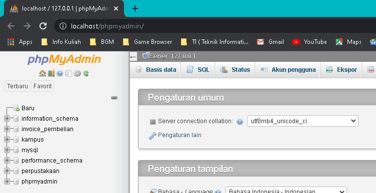
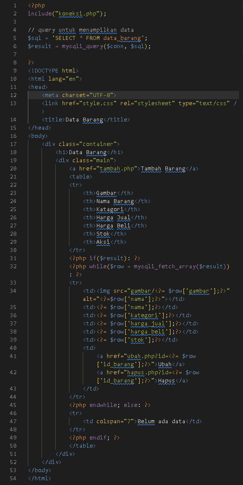

<p align="center">
	PEMROGRAMAN WEB
</p>
<p align="center">
	TUGAS PRATIKUM 8
</p>
<p align="center">
	Dosen Pengampu : Agung Nugroho, M.Kom
</p>
<p align="center"> 
	<b>Tugas untuk memenuhi syarat penilain pada Pert-10</b>
</p>

<p align="center">
	
</p>

<p align="center">
                 Nama  : Jose Fisto
</p>
<p align="center">
                 NIM   : 312010119
</p>
<p align="center">
                 Kelas : TI.20 A.1
</p>

<br/>
<br/>

<p align="center">
	<b>UNIVERSITAS PELITA BANGSA</b>
</p>
<p align="center">
	<b>FAKULTAS TEKNIK</b>
</p>
<p align="center">
	<b>TEKNIK INFORMATIKA</b>
</p>
<p align="center">
	<b>TA 2021 / 2022</b>
</p>

<br></br>

<hr>
</hr>

<br></br>

# Laporan Praktikum 8

Membuat CRUD Sederhana

Apa itu CRUD ?

CRUD adalah metode yang dapat dihubungkan dengan tampilan antarmuka (interface) sebagai fasilitator untuk melakukan perubahan data atau tampilan informasi berbentuk formulir, tabel atau laporan. Bentuk ini nantinya akan ditampilkan dalam browser atau aplikasi pada perangkat komputer pengguna.

Langkah langkah Membuat CRUD

## 1. Start modul xampp <br>
Langkah pertama ialah membuka xampp, dan selanjutnya start / hidupkan modul apache dan mysql

<p align="center">
	
</p>

Untuk pembuatan CRUD perlunya membuat database server menggunakan mysql, yang di jalankan langsung melalui xampp.

## 2. Mengakses MySQL client <br>
Perhatikan pada xampp untuk memastikan kedua modul sebelumnya telah berjalan dan kemudian buka halaman web service pada google chrome : http://localhost/phpmyadmin/ atau bisa mengklik `Admin` pada xampp di modul MySQL.

<p align="center">
	
</p>

<p align="center">
	
</p>
<center>
    Gambar 3. Tampilan phpmyadmin
</center>

## 3. Membuat Database : Studi Kasus Data Barang

Berikut studi kasus data barang

<p align="center">
	
</p>

- nama field = merupakan field nama
- Tipe Data = tipe data karakter
- Ukuran = merupakan jumlah kata / batasan ketikan nama data
- Keterangan = merupakan opsi lanjutan mengisyaratkan bahwa pada salah satu field yang memiliki hak khusus 

## 4. Membuat Database <br>
Membuat database baru dengan menjalankan perintah koding pada tab `mysql`

koding :

```php
CREATE DATABASE latihan1;
USE latihan1
```

- Create database, membuat database baru
- USE, memilih data yang ingin di gunakan

<p align="center">
	
</p>

Sukses

<p align="center">
	
</p>

## 5. Membuat Tabel <br>
Selanjutnya membuat tabel dengan koding sebagai berikut

- Create Table, membuat tabel baru
- "(" dan ")", memuat perintah membuat isian tabel
- field_name_columns, nama isian pada kolom tabel
- int / varchar, merupakan jenis data string
- (10)/(30), merupakan range / area pada jumlah kata yang memiliki batasan tertentu
- auto_increment, primary key, merupakan identitas indeks yang memiliki artian spesial pada kolom tersebut
```php
CREATE TABLE data_barang (
 id_barang int(10) auto_increment Primary Key,
 kategori varchar(30),
 nama varchar(30),
 gambar varchar(100),
 harga_beli decimal(10,0),
 harga_jual decimal(10,0),
 stok int(4)
);
```

Tampilan koding pada mysql

<p align="center">
	
</p>

Berhasil menjalankan

<p align="center">
	
</p>

## 6. Menambahkan Data <br>
Selanjutnya menambahkan data pada tabel

- Insert Into, memberikan perintah untuk memasukkan / menginputkan data barang
- (columns_1,columns_2,columns_3,...), merupakan data kolom mana yang akan di input datanya
- VALUE (1,2,3,...), menginputkan data sesuai pada kolomnya

```php
INSERT INTO data_barang (kategori, nama, gambar, harga_beli, harga_jual, stok)
VALUES ('Elektronik', 'HP Samsung Android', 'hp_samsung.jpg', 2000000, 2400000, 5),
('Elektronik', 'HP Xiaomi Android', 'hp_xiaomi.jpg', 1000000, 1400000, 5),
('Elektronik', 'HP OPPO Android', 'hp_oppo.jpg', 1800000, 2300000, 5);
```

Tampilan Koding pada mysql

<p align="center">
	
</p>

Sukses input data barang

<p align="center">
	
</p>

Tampilan data sudah terinput, jalankan koding `SELECT * FROM data_barang` pada mysql

<p align="center">
	
</p>

## 7. Membuat Program CRUD <br>
Selanjutnya buat folder **lab8_php_database** pada root directory web server, sesuai lokasi instalasi xampp folder **(c:\xampp\htdocs)**

<p align="center">
	
</p>

Selanjutnya masuk direktori web server dengan melalui link URL :
http://localhost/lab8_php_database/

<p align="center">
	
</p> 

## 8. Membuat file koneksi database <br>
Selanjutnya buat file baru dengan nama **koneksi.php**

```php
<?php
$host = "localhost";
$user = "root";
$pass = "";
$db = "latihan1";
$conn = mysqli_connect($host, $user, $pass, $db);
if ($conn == false)
{
 echo "Koneksi ke server gagal.";
 die();
} #else echo "Koneksi berhasil";
?>
```
Fungsi pada file di atas untuk mengkoneksikan database sebelumnya yang kita buat untuk digunakan sebagai data siap jadi.

Selanjutnya jalankan file tersebut melalui root direktori server, untuk menguji koneksi berhasil

<p align="center">
	
</p>

## 9. Membuat file index.php menampilkan tampilan output

Code index.php :

<p align="center">
	
</p>

Output :

<p align="center">
	
</p>

## 10. Membuat file tambah.php menambahkan data

Code tambah.php :

<p align="center">
	
</p>

<p align="center">
	
</p>

Output :

<p align="center">
	
</p>

## 11. Membuat file ubah.php mengubah / perubahan data

code ubah.php :

<p align="center">
	
</p>

<p align="center">
	
</p>

Output :

<p align="center">
	
</p>

<p align="center">
	
</p>

## 12. Membuat file hapus.php penghapusan data

Code hapus.php :

<p align="center">
	
</p>

Output :

<p align="center">
	
</p>